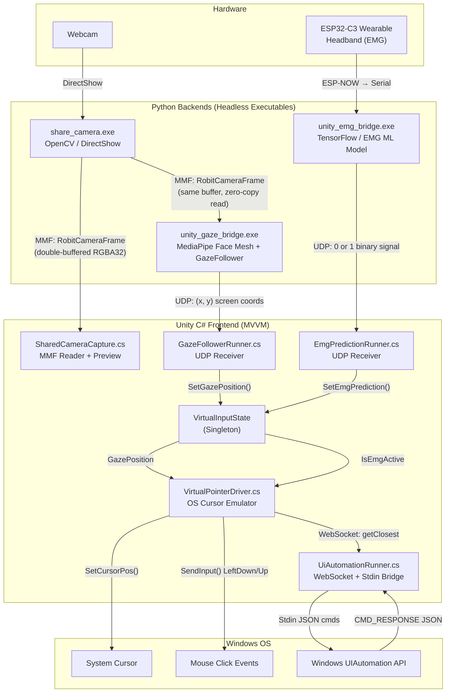
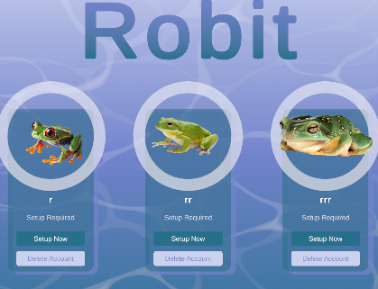
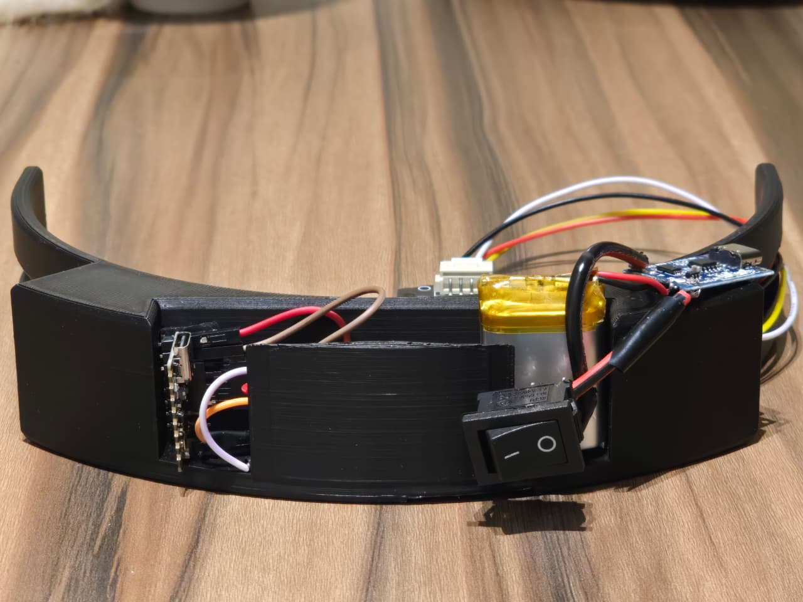
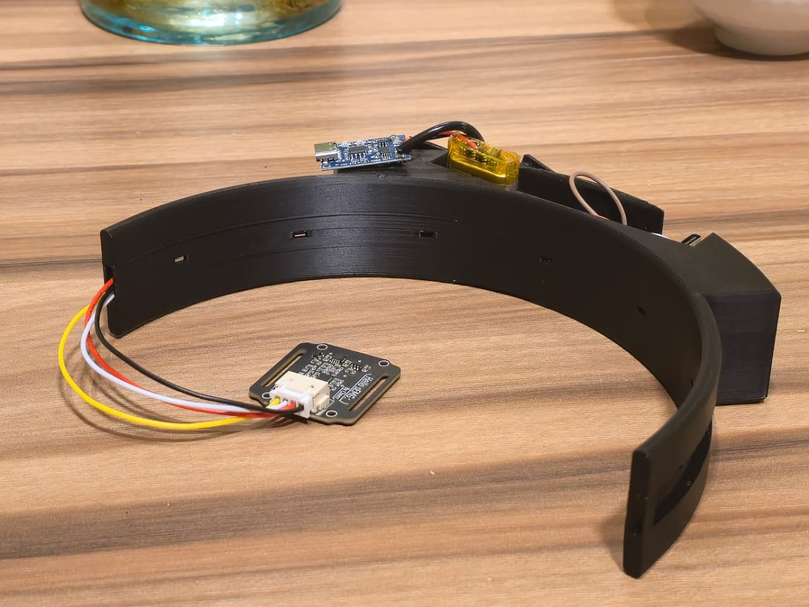

# Robit - EMG and Eye-Gaze Hybrid Interface for Assistive Computer Control

Robit is a low-cost, multimodal Windows operating-system wrapper that fuses **eye-gaze tracking**, **EMG-based jaw-clench triggers**, and **computer-vision eyebrow-raise detection** into a single, hands-free computer control system. Gaze provides continuous, low-effort cursor positioning across the whole screen, a deliberate jaw clench (captured by a custom ESP32-C3 EMG headband) acts as an instantaneous click, and an eyebrow raise activates a localized UI-snapping grid for high-precision selection on dense interfaces. The system runs as a transparent, click-through overlay on top of any Windows application, requiring no driver installation or modifications to the underlying software.

---

## Table of Contents

- [Robit - EMG and Eye-Gaze Hybrid Interface for Assistive Computer Control](#robit---emg-and-eye-gaze-hybrid-interface-for-assistive-computer-control)
  - [Table of Contents](#table-of-contents)
  - [Team Members](#team-members)
  - [Problem Statement](#problem-statement)
  - [Features](#features)
  - [System Architecture](#system-architecture)
  - [Technologies Used](#technologies-used)
  - [Setup Instructions](#setup-instructions)
    - [1. Install the Application](#1-install-the-application)
    - [2. Assemble and Flash the EMG Headband Hardware](#2-assemble-and-flash-the-emg-headband-hardware)
    - [3. Software Environment](#3-software-environment)
  - [Deployment Instructions](#deployment-instructions)
  - [Usage Guide](#usage-guide)
    - [EMG Headband Placement](#emg-headband-placement)
    - [Eye-Gaze Calibration](#eye-gaze-calibration)
    - [Basic Interaction (Eye Gaze + Bite)](#basic-interaction-eye-gaze--bite)
    - [UI Element Snapping (precision targeting)](#ui-element-snapping-precision-targeting)
    - [Overlay UI](#overlay-ui)
  - [Screenshots / Demo](#screenshots--demo)

---

## Team Members

| Name | ID | Program |
|---|---|---|
| Mohaned Atef | 202100383 | SWAPD |
| Farha Ahmed | 202200169 | DSAI |
| Rofida Khaled | 202201413 | SWGCG |
| Elhusseain Aboulfetouh | 202202239 | SWAPD |

**Supervisor**
Dr. Mayada Hadhoud

*Zewail City of Science and Technology - School of Computational Sciences and Artificial Intelligence (CSAI)*
*Bachelor of Science in CSAI - Graduation Project, June 2026*

---

## Problem Statement

Approximately 1.3 billion people worldwide live with a significant disability, a large share of which involves motor impairment for example, up to 85% of stroke survivors experience upper-limb impairments that limit independent computer use. Existing assistive technologies typically rely on a single input modality, and each modality has well-documented limitations: gaze-only systems suffer from the **"Midas touch" problem** (unintentional selection from simply looking at a target) and visual fatigue from dwell-time clicking, while EMG-only systems suffer from accuracy drift, repeated muscle effort, and fatigue during continuous control. On top of these technical limitations, roughly 80% of people with significant disabilities live in low- and middle-income regions where commercial eye-trackers and Brain-Computer Interface (BCI) systems, often costing thousands of dollars, are financially out of reach.

Robit addresses this gap by combining three complementary, low-cost input modalities (gaze, EMG, and facial gesture recognition) into a single hands-free interface, eliminating the trade-off between accuracy, fatigue, and cost that limits existing single-modality and high-end commercial solutions.

---

## Features

- **Continuous gaze-based cursor control**: full-screen coverage using the GazeFollower/MGazeNet deep-learning model with a 13-point, white-background calibration (45 frames per point).
- **EMG jaw-clench click detection**: a 4-feature, optimized neural-network classifier (`filt_AR_2`, `filt_AR_3`, `env_AR_3`, `env_WAMP`) achieving 80.39% accuracy, 0.81 recall, and 0.81 AUC-ROC, validated across 13 users.
- **Eyebrow-raise secondary trigger**: Euclidean-distance-based detection (MediaPipe Face Mesh) that opens a localized UI-snapping grid when eyebrow elevation exceeds the calibrated baseline by more than 12%.
- **UI Automation fallback**: holding a jaw clench for ≥2 seconds queries the Windows UIAutomation API (via FlaUI) to highlight the six nearest interactable elements, enabling pixel-imprecise selection of small/dense UI targets.
- **Seamless OS-level transparency**: a fully transparent, always-on-top, click-through Unity overlay (P/Invoke into `user32.dll`/`dwmapi.dll`) that works directly with unmodified desktop applications.
- **Custom wireless EMG headband**: a dry-electrode sEMG sensor on an ESP32-C3 microcontroller, communicating over the low-latency ESP-NOW protocol to a USB receiver dongle (no Bluetooth pairing or cloud connectivity required).
- **Overlay macro system, app launcher, and home-control widget**: quick-access OS actions (zoom, tab switching, page up/down), an application launcher with search, and a dashboard for volume, brightness, display scale, time, and weather.
- **Privacy-by-design**: all biometric data (EMG signals, gaze patterns) stays local to the device and is never transmitted to the cloud or third parties; users can recalibrate at any time without vendor involvement.

---

## System Architecture

Robit is split across two tiers: a **Unity C# frontend** that owns the UI, OS windowing, and input composition (following a strict **Model-View-ViewModel** pattern), and a set of **headless Python/C# executables** that own machine-learning inference and webcam capture. Communication between tiers is performed via shared **Memory-Mapped Files (MMF)** for high-bandwidth video frames and **asynchronous UDP sockets** for low-latency coordinate/click telemetry. Empirical profiling shows a median frame time of 16.666 ms (60 Hz), under 0.5 ms of CPU time per frame, and a stable memory footprint of ~348 MB.

The system topology is organized into three conceptual layers: an **Input Module** that collects raw physiological/visual data, a **Cleaning and Acquisition Module** that filters streams and interprets intent (gaze SVR calibration, EMG feature extraction/classification, eyebrow-distance evaluation), and an **Interface Module** that turns clean intent signals into OS-level commands while rendering the transparent overlay. A complete diagram-by-diagram breakdown of each subsystem (bootstrap lifecycle, camera pipeline, fusion logic, UI Automation, IPC design trade-offs, and the component reference table) is provided in the [Appendix](#appendix-technical-architecture-deep-dive).

---

## Technologies Used

- **Frontend / Overlay Engine:** Unity 6000.3.8f1 (Universal Render Pipeline), C#, Unity UI Toolkit, MVVM architecture, Platform Invocation Services (P/Invoke) into `user32.dll` / `dwmapi.dll`
- **Backend (Signal Processing & ML Inference):** Python 3.11, TensorFlow/Keras (EMG classifier, `.h5`), GazeFollower + MGazeNet (Alibaba MNN runtime), MediaPipe Face Mesh, OpenCV, NumPy, Statsmodels (autoregressive features), scikit-learn, imbalanced-learn (SMOTE), Pandas
- **Inter-Process Communication:** Windows Memory-Mapped Files (zero-copy camera frames), asynchronous UDP sockets (gaze/EMG telemetry), WebSocket + stdin/stdout bridge (UI Automation)
- **UI Automation Fallback:** .NET WinForms, FlaUI (UIA3 wrapper), Newtonsoft.Json
- **Hardware / Firmware:** ESP32-C3 microcontroller ×2 (Arduino C/C++), dry-electrode sEMG sensor, ESP-NOW wireless protocol, PLA 3D-printed headband enclosure
- **Experiment Tracking & Optimization:** MLflow (training run/metric logging), Grey Wolf Optimization (hyperparameter search)
- **Testing:** Unity Test Framework (UTF/NUnit), EditMode unit tests and PlayMode (coroutine) integration tests
- **3D/Art Pipeline:** Blender 4.5 (modeling, rigging, animation), Adobe Substance Painter (PBR texturing), Adobe Illustrator/Figma (UI assets and design tokens), toon/cel shader for the "Robit" mascot
- **Data & Privacy:** All biometric data (EMG, gaze) is processed and stored locally, no cloud services or third-party data transmission

---

## Setup Instructions

### 1. Install the Application
1. Open the official Robit GitHub repository: `https://github.com/MohanedAtef238/Robit`.
2. Go to the repository's **Releases** page and download the latest `setup.exe` installer.
3. Run `setup.exe` and follow the installation wizard to extract the application files to your chosen directory.

### 2. Assemble and Flash the EMG Headband Hardware
The wearable bridge requires **two ESP32-C3 boards** (a Sender on the headband, and a Receiver as a USB dongle) communicating over **ESP-NOW** for ultra-low-latency transmission.

**Step 1 - Find the Receiver's MAC address**
1. Plug the **Receiver ESP32** (USB dongle) into your PC.
2. Open the `Mac_Address_Reader` sketch in the Arduino IDE and upload it to the board.
3. Open the Serial Monitor at `115200` baud and copy the printed MAC address (e.g., `94:A9:90:7B:63:24`).

**Step 2 - Flash the Sender (headband)**
1. Open the `Sender` sketch in the Arduino IDE.
2. Replace the placeholder `receiverAddress` array with the MAC address copied above, e.g.:
   `uint8_t receiverAddress[] = {0x94, 0xA9, 0x90, 0x7B, 0x63, 0x24};`
3. Connect the **Headband ESP32** and upload the sketch.

   **Wiring for the Sender:**
   - `GPIO 3` -> EMG Signal
   - `GPIO 4` -> EMG Detect/Reference
   - `5V` -> Power (switch placed on this positive wire)
   - `GND` -> Ground

**Step 3 - Flash the Receiver (USB dongle)**
1. Plug the Receiver ESP32 back into the PC.
2. Open the `Receiver` sketch in the Arduino IDE and upload it.

### 3. Software Environment
- **OS:** Windows 11 (the transparency/click-through overlay relies on the Windows 11 Desktop Window Manager).
- **Backend runtime:** Python 3.11 (required for compatibility with the `gazefollower` package and TensorFlow/Keras).
- **Frontend runtime:** Unity 6000.3.8f1 with URP (only required if building from source).
- Minimum recommended PC spec: Windows 10+, 4 GB RAM, a standard 720p+ webcam.

---

## Deployment Instructions

1. **Plug in the receiver:** Keep the Receiver ESP32 dongle plugged into a USB port on the PC at all times.
2. **Power the headband:** Put on the headband and flip the power switch on the Headband ESP32. The Receiver's blue LED turns on as soon as it receives a data packet; it turns off if the headband disconnects, loses power, or goes out of range.
3. **Launch Robit:** Start the application from the installed shortcut/executable. On launch, the Unity frontend automatically spawns the headless backend executables (`share_camera.exe`, `unity_gaze_bridge.exe`, `unity_emg_bridge.exe`, and the .NET UI Automation process) as managed child processes attached to a Windows Job Object, so they are cleanly terminated even if Unity is force-closed.
4. **First-run calibration:** On first launch, the gaze calibration UI and EMG headband placement guide appear automatically (see [Usage Guide](#usage-guide)).
5. **Verify connectivity (optional):** Open the Arduino Serial Plotter at `115200` baud while wearing the headband to visually confirm muscle signals are being captured in real time.

> The system is designed to run entirely locally; no servers, containers, or cloud deployment steps are required.

---

## Usage Guide

### EMG Headband Placement
1. Place the headband securely on your head and locate the temporalis muscle (just above and slightly forward of the ear).
2. Adjust the headband so the dry EMG sensor sits flush against the temporalis muscle, with its indicator lines horizontal.
3. Fasten the headband firmly enough for consistent skin contact without sacrificing comfort.

### Eye-Gaze Calibration
1. On first use, the calibration UI displays 13 points on a white background, one at a time.
2. Focus your gaze on each point while the system collects 45 frames, then wait for the next point to appear.
3. Once all 13 points are completed, calibration finishes and the system is ready to use.
4. Recalibration can be triggered at any time from the application settings/overlay if gaze accuracy degrades.

### Basic Interaction (Eye Gaze + Bite)
1. Look at a location on screen to move the cursor there.
2. Position your gaze over the desired target.
3. Perform a jaw-clench ("bite") gesture to click, by default, a single bite performs a left-click.

### UI Element Snapping (precision targeting)
1. Move your gaze near a small or densely packed interactive element.
2. Hold the bite gesture to activate snapping mode; the system highlights up to six nearby interactable elements with index labels.
3. Select the desired index using your configured interaction method; the cursor snaps to that element.
4. Bite again to activate/interact with the snapped element.

### Overlay UI
- A small green marker in the bottom-left corner opens the 3D "Robit" mascot and the main button panel.
- **Macros:** quick OS actions such as zoom in/out, tab switching, and Page Up/Down.
- **Home Control:** a dashboard for volume, brightness, display scale, time, and weather.
- **App Launcher:** browse or search installed applications and launch them directly from the overlay.

---

## Screenshots / Demo

### Opening UI (profile/setup screen)

### Widget Menu (time, weather, display, reminders, "Ask Robit")

### EMG Headband Prototype
| View 1 | View 2 |
|--------|--------|
|  |  |

### "Robit" Mascot — Shading & Shape Keys
| Shaded Model | Shape Keying | Shape Keys |
|---|---|---|
|  |  |  |

---
