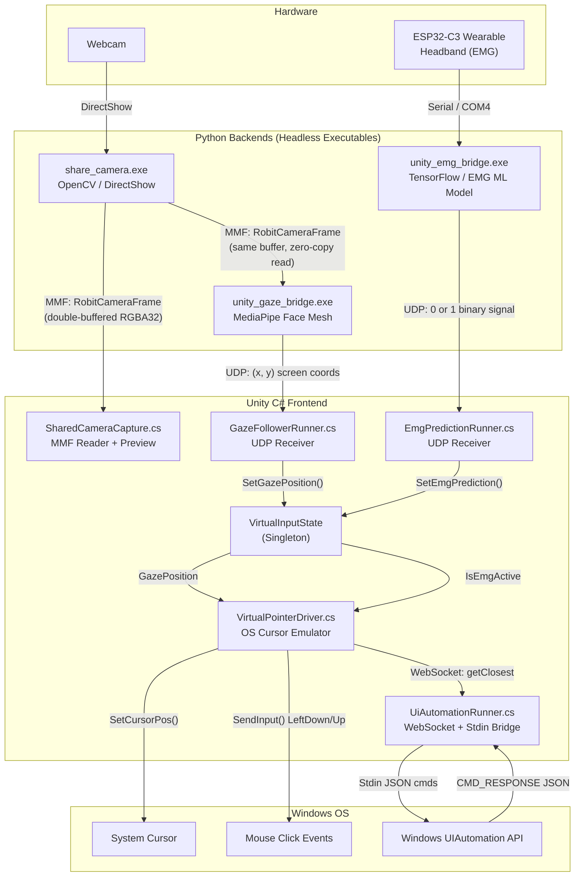
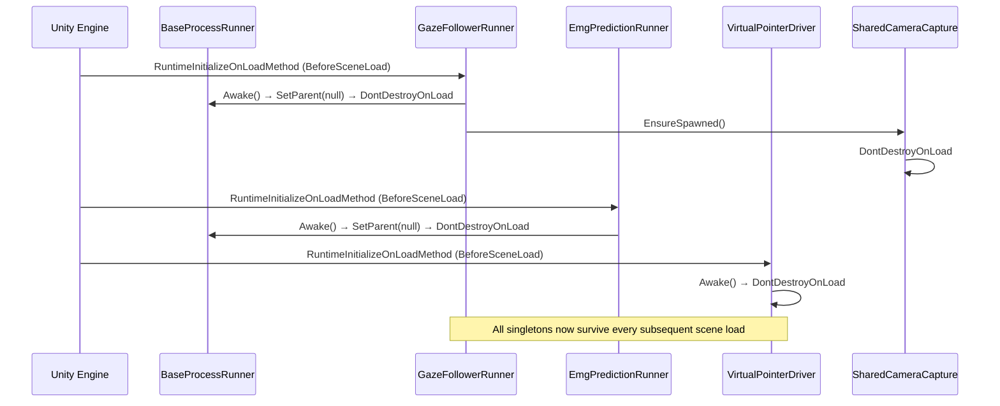
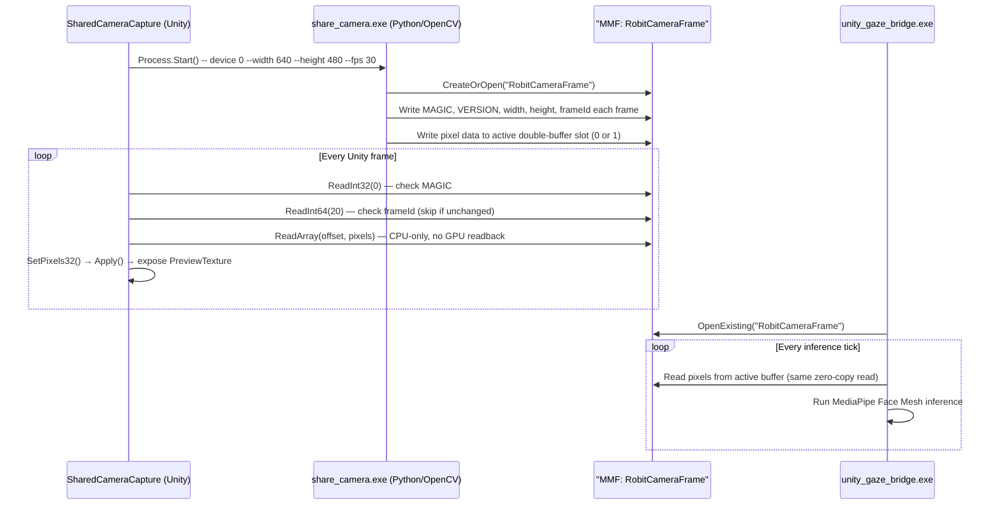
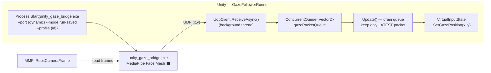
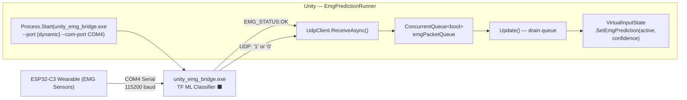
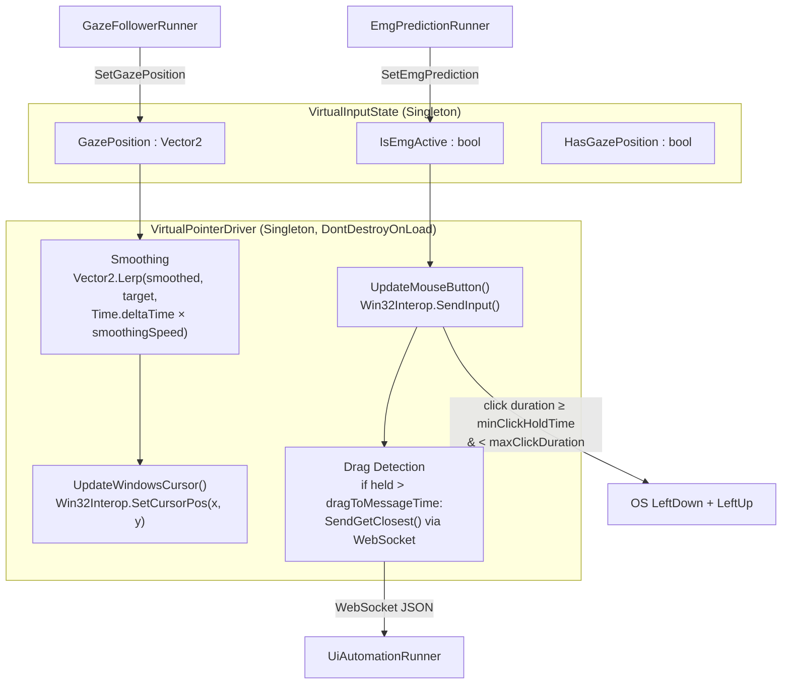
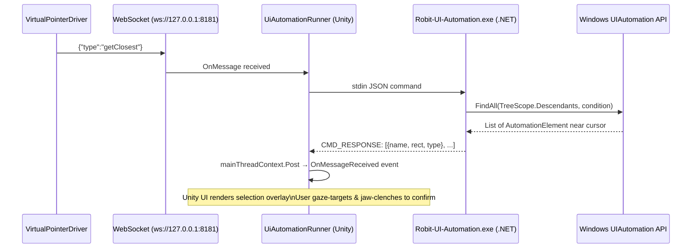
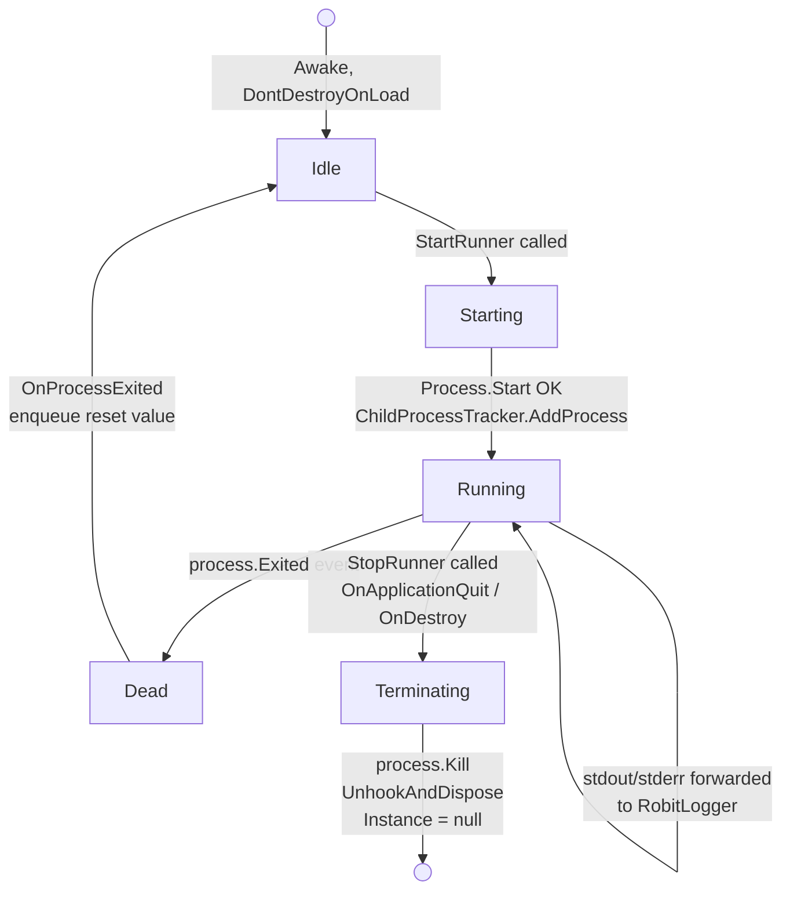
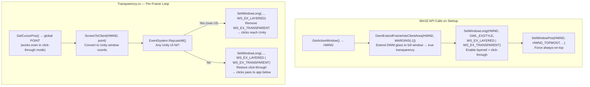
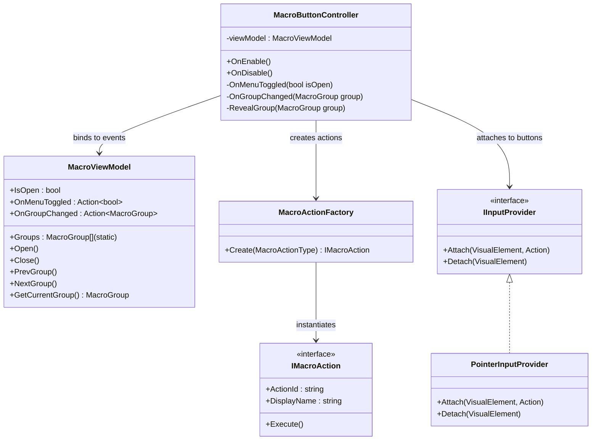

# Robit

> A low-cost, multimodal, hands-free Windows OS wrapper that fuses **eye-gaze tracking** with **EMG-based jaw-clench triggers** for reliable assistive computer control.

---

## Table of Contents

- [System Architecture Overview](#system-architecture-overview)
- [Bootstrap & Scene Lifecycle](#bootstrap--scene-lifecycle)
- [Camera Pipeline](#camera-pipeline)
- [Gaze Tracking (Black Box)](#gaze-tracking-black-box)
- [EMG Input (Black Box)](#emg-input-black-box)
- [Virtual Input State & Cursor Driver](#virtual-input-state--cursor-driver)
- [UI Automation Subsystem](#ui-automation-subsystem)
- [Process Lifecycle Management](#process-lifecycle-management)
- [IPC Architecture — Rejected Alternatives](#ipc-architecture--rejected-alternatives)
- [Windows API & Transparency Layer](#windows-api--transparency-layer)
- [Macro Button System (MVVM)](#macro-button-system-mvvm)
- [Component Reference](#component-reference)

---

## System Architecture Overview

Robit is split across two tiers: a **Unity C# frontend** that owns the UI, OS windowing, and input composition, and a set of **headless Python/C# executables** that own the machine learning inference and webcam capture. All communication between tiers is performed via shared memory (video frames) and UDP datagrams (coordinates and click events).

---

## Bootstrap & Scene Lifecycle

Every major runner is a persistent singleton. They bootstrap themselves before any scene loads using `[RuntimeInitializeOnLoadMethod]` and call `DontDestroyOnLoad()` to survive scene transitions.

---

## Camera Pipeline

The webcam is owned **exclusively** by `share_camera.exe` to avoid handle conflicts between Unity and Python. Unity's `SharedCameraCapture.cs` and the gaze bridge both read from the same **Memory Mapped File**, making this a zero-copy, zero-conflict distribution pattern.

**MMF Buffer Layout:**

| Offset | Size | Field |
|--------|------|-------|
| 0 | 4 | `MAGIC` — `0x524F4254` (`"ROBT"`) |
| 4 | 4 | `VERSION` — currently `1` |
| 8 | 4 | `width` |
| 12 | 4 | `height` |
| 16 | 4 | `format` — `1 = RGBA32` |
| 20 | 8 | `frameId` — monotonically increasing `int64` |
| 28 | 8 | `timestamp` — Windows FILETIME ticks |
| 36 | 4 | `activeBuffer` — `0` or `1` (double-buffered) |
| 40+ | ... | pixel data — two slots of `MAX_WIDTH × MAX_HEIGHT × 4` |

---

## Gaze Tracking (Black Box)

From Unity's perspective, the gaze bridge is an opaque executable. `GazeFollowerRunner.cs` only cares about its inputs and outputs.

**Why only the latest packet?** Gaze coordinates arrive faster than the 60 FPS Unity loop. Replaying stale packets would cause the cursor to lag behind the user's eye. The queue is drained completely each frame and only the newest value is applied.

---

## EMG Input (Black Box)

`EmgPredictionRunner.cs` follows the same pattern. The EMG bridge reads raw serial data from the ESP32 wearable, runs an ML classifier, and sends a binary 0/1 UDP signal.

On process exit, `OnProcessExited` enqueues a `false` signal so the cursor never gets stuck in a held-down click state after the bridge dies.

---

## Virtual Input State & Cursor Driver

`VirtualInputState` is the fusion point. It receives gaze positions and EMG predictions independently and exposes them as a unified interface to `VirtualPointerDriver`.

**Click vs. Drag logic in `VirtualPointerDriver`:**
- Signal starts → record `emgStartTime`
- Signal ends after `minClickHoldTime` → fire `LeftDown` + `LeftUp` (intentional tap)
- Signal ends before `minClickHoldTime` → discard (electrical noise)
- Signal held past `dragToMessageTime` (default 2s) → fire `getClosest` WebSocket message to the UI Automation server and release the click

---

## UI Automation Subsystem

When a user performs a sustained gaze-and-hold gesture, Robit surfaces a smart "closest UI element" selection overlay via the Windows UIAutomation API rather than relying on the user hitting a pixel-perfect target.

---

## Process Lifecycle Management

**Key design decisions:**
- `ChildProcessTracker.cs` creates a Windows **Job Object** and assigns every spawned process to it. If Unity crashes (e.g. killed via Task Manager), the OS automatically terminates all child processes in the job, eliminating zombie processes entirely.
- `BaseProcessRunner<T>` calls `SetParent(null)` before `DontDestroyOnLoad` because Unity only preserves **root** GameObjects across scene loads. A child object would be silently destroyed, severing the MMF and UDP connections.

---

## IPC Architecture — Rejected Alternatives

| Alternative | Why it was rejected |
|---|---|
| **Unity Barracuda / Sentis (C# ML)** | Lacks support for custom TensorFlow ops used by our MediaPipe and EMG models. Converting to ONNX produced unsupported-layer errors and measurable precision loss. |
| **Python for Unity (embedded interpreter)** | Python's GIL and heavy inference calls block the Unity thread pool. Even on a background thread, GIL contention causes frame-time spikes that destroy our 16.666 ms budget. |
| **TCP Sockets instead of UDP** | TCP guarantees ordered delivery — exactly the wrong property for a live gaze stream. A stale (x, y) packet queued behind newer ones causes visible cursor lag. UDP lets us discard stale data intentionally. |
| **HTTP / REST API** | Round-trip latency of HTTP is measured in ms to tens of ms per request. At 60 Hz the gaze bridge fires ~60 position updates per second, making HTTP completely unsuitable. |
| **Unity WebCamTexture (built-in)** | Creates a GPU→CPU readback stall every frame. Also holds an exclusive DirectShow handle that blocks the Python gaze bridge from opening the same webcam. The external `share_camera.exe` + MMF design eliminates both problems. |
| **Shared memory direct from Unity** | Unity's C# runtime cannot efficiently write raw pixel arrays to MMF without unsafe buffer copies. Having `share_camera.exe` own the camera entirely avoids the Unity rendering pipeline dependency and ensures a full 1280×720 feed at zero frame drops. |

---

## Windows API & Transparency Layer

Robit renders as a transparent, always-on-top, click-through overlay window using direct `user32.dll` and `Dwmapi.dll` P/Invokes.

**The click-through paradox:** When `WS_EX_TRANSPARENT` is active, Windows does not deliver any mouse events to Unity — including `OnPointerEnter`. The only way to detect hover is to poll the cursor position ourselves via `GetCursorPos()`, which always works regardless of window style, then raycasting from Unity's side.

---

## Macro Button System (MVVM)

The overlay macro panel uses a strict **Model-View-ViewModel** architecture via Unity UI Toolkit.

- **Adding a new action**: implement `IMacroAction`, add to `MacroActionType` enum, add a case in `MacroActionFactory.Create()`.
- **Adding a new input modality** (e.g. gaze dwell): implement `IInputProvider` and swap it in `MacroButtonController.OnEnable()`.

---

## Component Reference

| File | Location | Role |
|---|---|---|
| `BaseProcessRunner.cs` | `OverlaySystem/` | Generic singleton base — process start, I/O redirect, teardown |
| `BaseUdpProcessRunner.cs` | `OverlaySystem/` | Extends base with UDP port binding and async receive loop |
| `ChildProcessTracker.cs` | `OverlaySystem/` | Windows Job Object — guarantees child process cleanup on crash |
| `SharedCameraCapture.cs` | `OverlaySystem/` | Launches `share_camera.exe`, reads MMF, exposes `Texture2D` |
| `GazeFollowerRunner.cs` | `OverlaySystem/` | Manages `unity_gaze_bridge.exe`, UDP → `VirtualInputState` |
| `EmgPredictionRunner.cs` | `Input/` | Manages `unity_emg_bridge.exe`, UDP → `VirtualInputState` |
| `VirtualPointerDriver.cs` | `Input/` | Reads `VirtualInputState`, drives OS cursor + click via P/Invoke |
| `UiAutomationRunner.cs` | `OverlaySystem/` | Bridges WebSocket from `VirtualPointerDriver` to `.NET` UIAutomation server |
| `GazeCalibrationController.cs` | `OverlaySystem/` | Orchestrates gaze calibration phases via UDP, persists profiles |
| `MacroViewModel.cs` | `MacroSystem/` | MVVM ViewModel — macro group state and menu open/close |
| `MacroButtonController.cs` | `MacroSystem/` | MVVM View — binds UI Toolkit elements to ViewModel events |
| `MacroActionFactory.cs` | `MacroSystem/` | Factory — creates `IMacroAction` instances from enum |
| `Win32Interop.cs` | `Utils/` | All P/Invoke declarations (`SetCursorPos`, `SendInput`, etc.) |
| `WindowManager.cs` | `Utils/` | Window HWND caching + extended style helpers |
| `RobitLogger.cs` | `Utils/` | Thread-safe Unity log wrapper used across all systems |
